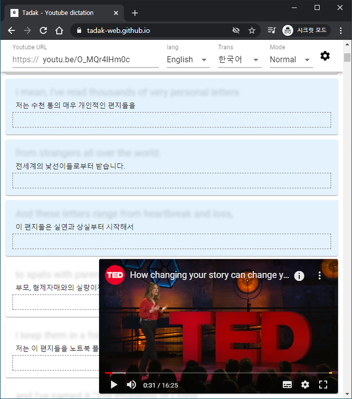
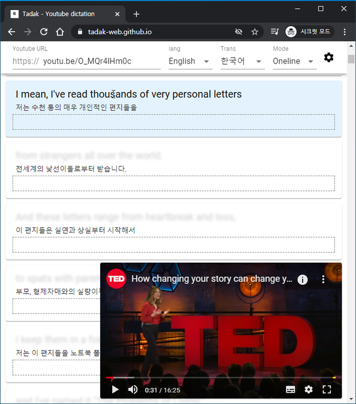
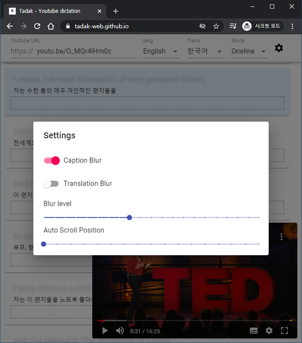
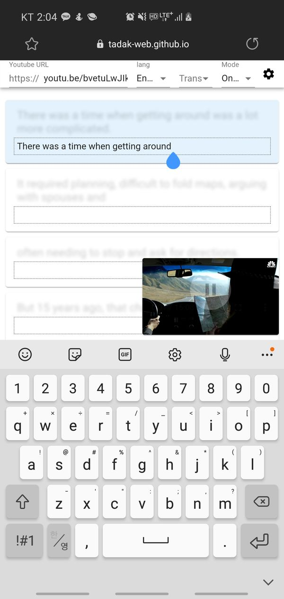

# Tadak(타닥)

영어 공부를 위한 유튜브 딕테이션(Dictation) 사이트

주소: [https://tadak-web.github.io/](https://tadak-web.github.io/)

자세한 첨부된 그림과 같이 자막이 있는 유튜브 URL을 입력하셔서 사용하시면 됩니다.
(자동 생성 자막은 지원 X)

- Youtube URL: 유튜브 URL

- lang: 받아쓰기할 언어

- Trans: 번역 혹은 참고할 언어

- Mode: Normal(선택영역 반복) / Oneline(한줄씩 반복)

## 예시

Youtube URL이 youtu.be/O_MQr4lHm0c 일때 Blur 처리된 경우 입니다.

### Normal 모드

Normal 모드시 반복할 부분의 시작과 끝 부분을 클릭하면 아래와 같이 색이 변하게 되며, 선택된 부분에서 영상이 반복 재생됩니다.

### Oneline 모드

oneline 모드시 한줄씩 영상이 반복 재생 됩니다.

### 원문확인

Blur 처리된 경우 마우스를 원문위에 올리시면 원문을 확인 하실 수 있습니다.

### 옵션

Blur 처리 설정, Blur 강도, 오토 스크롤 위치 등 설정이 가능합니다.

### Mobile

